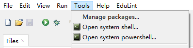
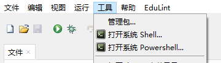

# [Thonny-SystemPowershell](https://github.com/Jysume/thonny-SystemPowershell)

>   Add a buttom to open system powershell for [Thonny](https://thonny.org) IDE in Windows(Support English and Chinese)

## Installation

#### Install using Thonny

1. Go to `Thonny → Tools → Manage plug-ins`
2. Search for `thonny-SystemPowershell`
3. Click `Install`

## Enjoy the plugin

1. After installing, close and open Thonny, so the plugin is loaded
2. Go to `Thonny → Tools `
3. Click `Open system powershell...`